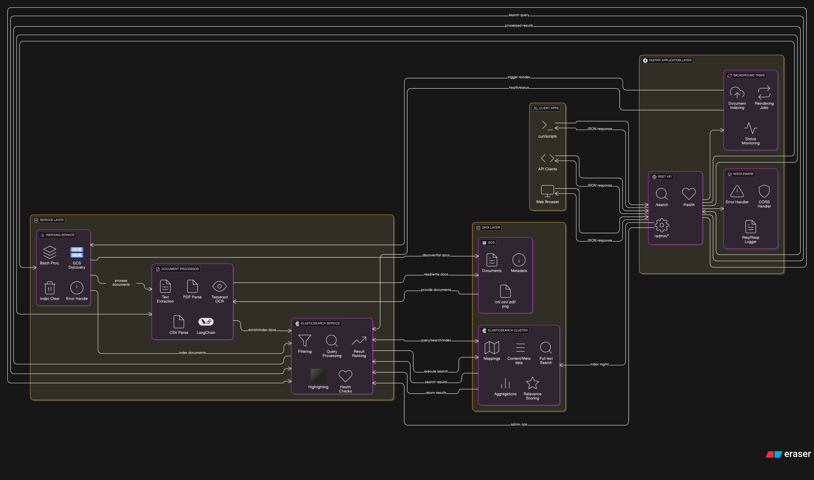

# Document Search Application - Architecture Diagram

## High-Level Architecture Overview


## Search Flow Details

### 1. **User Query** → **API Endpoint**
- User sends HTTP GET request to `/api/v1/search?q=search_term`
- FastAPI receives and validates the request
- Parameters: query string, limit, file_type filter, min_score

### 2. **API Route** → **Elasticsearch Service**
- Route handler creates `SearchQuery` object
- Calls `elasticsearch_service.search_documents()`
- Service builds Elasticsearch query with:
  - Full-text search across document content
  - Relevance scoring
  - Highlighting of matching terms
  - Filtering by file type (optional)

### 3. **Elasticsearch Query Execution**
- Searches indexed document content
- Applies relevance scoring
- Generates highlighted snippets
- Filters results by minimum score
- Returns ranked results with metadata

### 4. **Response Processing**
- **Simple Search (`/search`)**: Returns array of GCS file paths
- **Detailed Search (`/search_detailed`)**: Returns full `SearchResponse` with:
  - Document excerpts with highlights
  - Relevance scores
  - File metadata (size, type, dates)
  - GCS download URLs
  - Execution time

### 5. **User Response**
- JSON response sent back to client
- Contains searchable content and file references
- User can access original files via GCS URLs

## Data Flow Summary

```
Documents (GCS) → [Indexing Pipeline] → Elasticsearch Index
                                              ↓
User Query → FastAPI → Elasticsearch Search → Results → User
```
